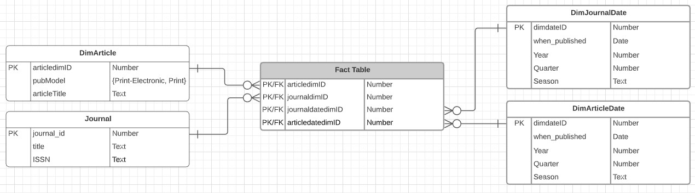

```{r, echo = FALSE}
# install packages and libraries
# credit for function: https://vbaliga.github.io/verify-that-r-packages-are-installed-and-loaded/
## If a package is installed, it will be loaded. If any 
## are not, the missing package(s) will be installed 
## from CRAN and then loaded.

## First specify the packages of interest
packages = c("RSQLite", "DBI", "XML", "rlang", 
             "dplyr", "tidyr", "lubridate")

## Now load or install&load all
package.check <- lapply(
  packages,
  FUN = function(x) {
    if (!require(x, character.only = TRUE)) {
      install.packages(x, dependencies = TRUE)
      library(x, character.only = TRUE)
    }
  }
)
```

```{r, echo = FALSE}
library(dplyr)
library(tidyr)
library(DBI)
library(XML)
library(rlang)
library(lubridate)
```

```{r}
# create an ephemeral in-memory RSQLite database
con <- dbConnect(RSQLite::SQLite(), ":memory:")
```
# Part 1. Load XML
## 1. Logical Model


## 2. Parsing XML and Loading data into the database

### 2.1 Authors: Parsing and Importing data
#### 2.1.2 Creating the Articles dataframe
```{r}
# define function to retrieve authors list
single_author_list <- function(xmlNode) {
  xmlNodeCopy <- duplicate(xmlNode)
  xcopy <- newXMLDoc(xmlNodeCopy)
  lastname <- xpathSApply(xcopy, '//LastName', xmlValue)
  firstname <- xpathSApply(xcopy, '//ForeName', xmlValue)
  initials <- xpathSApply(xcopy, '//Initials', xmlValue)
  
  return (paste(lastname, firstname, initials, sep='*'))
}
# parse attributes and elements on each authors node
get_authors <- function(xmlNode) {
  newxmlNodeCopy <- duplicate(xmlNode)
  pb<-newXMLDoc(newxmlNodeCopy)
  g <-newXMLDoc(xmlNode)
  names=xpathSApply(g,'//Author',single_author_list)
  names_single_string=paste(names,collapse='|')
  affiliation=xpathSApply(pb,'//Affiliation', xmlValue)
  return (paste(affiliation,names_single_string, sep='|'))
}
# read XML file and parse into DOM
xml_file <- "pubmed_sample.xml"
xmlDOM <- xmlParse(file = xml_file)
xmlRoot <- xmlRoot(xmlDOM)
# get authors list from XML file
author_list <- xpathSApply(xmlRoot,'//PubmedArticle//AuthorList', get_authors)
# add authors list to data frame
author_list_df <- tibble::enframe(author_list) %>%  separate(value, c('Affiliation', paste0('x', seq(12))), sep='\\|') %>% pivot_longer(starts_with('x'), names_to = 'index', values_to = 'data') %>% filter(!is.na(data)) %>% separate(col <- data, into = c('LastName', 'FirstName', 'Initial'), sep='\\*')
# format authors data frame
author_list_df_formatted <- author_list_df %>% distinct(FirstName, LastName, Initial)
author_list_with_ID <- tibble::rowid_to_column(author_list_df_formatted, "authorID")
author_list_with_ID
```

#### 2.1.2 Creating the Article-Authors dataframe
```{r}
# create article-author data frame
authors_df_initial <- merge(author_list_with_ID, author_list_df, all.x=TRUE)
#authors_df_initial
authorsDataframe=authors_df_initial %>% 
  dplyr::rename(
    articleID = name
    )
#authors_df_initial
#remove extra columns from data frame
authorsDataframeFinal <- subset(authorsDataframe, select = -c(index))
# print data frame
authorsDataframeFinal_done <-data.frame(authorid=authorsDataframeFinal[4], Lastname=authorsDataframeFinal[1],Firstname=authorsDataframeFinal[2],Initial=authorsDataframeFinal[3])
article_authors_df <- data.frame(authorid=authorsDataframeFinal[4], articleid=authorsDataframeFinal[5])

# print data frame
article_authors_df
```


#### 2.1.3 Importing Authors and Article-Authors into the database
```{r}
# drop authors table if exists
res <- dbExecute(con, "
  DROP TABLE IF EXISTS authors;
")

# create authors table
res <- dbExecute(con, "
  CREATE TABLE IF NOT EXISTS authors
  (
    author_id INTEGER PRIMARY KEY AUTOINCREMENT,
    last_name VARCHAR(255) NOT NULL,
    first_name VARCHAR(255) NOT NULL,
    initials VARCHAR(10) NOT NULL,
    UNIQUE (last_name, first_name)
  );
")

# load authors table
res <- dbSendQuery(con, "INSERT INTO authors (author_id, last_name, first_name, initials) VALUES (:authorID, :LastName, :FirstName, :Initial);", author_list_with_ID)
res <- dbSendQuery(con, "SELECT * FROM authors LIMIT 5;")
dbFetch(res)
```

```{r}
# drop article_author table if exists
res <- dbExecute(con, "
  DROP TABLE IF EXISTS article_author;
")

# create article_author table
res <- dbExecute(con, "
  CREATE TABLE IF NOT EXISTS article_author
  (
    author_id INTEGER,
    article_id INTEGER,
    PRIMARY KEY(article_id, author_id),
    FOREIGN KEY (article_id) REFERENCES articles (article_id),
    FOREIGN KEY (author_id) REFERENCES authors (author_id)
  );
")

# load article authors table
res <- dbSendQuery(con, "INSERT INTO article_author (author_id, article_id) VALUES (:authorID, :articleID);", article_authors_df)
res <- dbSendQuery(con, "SELECT * FROM article_author LIMIT 5;")
dbFetch(res)
```

### 2.2 Journals: Parsing and Importing data
#### 2.2.1 Creating the Journals dataframe

### Creating the journal dataframe
```{r}
# read XML file and parse into DOM
xml_file <- "pubmed_sample.xml"
xmlDOM <- xmlParse(file = xml_file)
xmlRoot <- xmlRoot(xmlDOM)

# export journal ISSN
ISSN <- xpathSApply(xmlRoot, '//Article/Journal/ISSN', xmlValue)
JournalISSN <- tibble::enframe(ISSN)

# export journal issue
journalIssue <- xpathSApply(xmlRoot,'//Article//Journal/JournalIssue', xmlValue)
JIssue <- tibble::enframe(journalIssue)

# export journal issue volume
IssueVolume <- xpathSApply(xmlRoot, '//Article//Journal/JournalIssue/Volume', xmlValue)
JournalIssueVolume <- tibble::enframe(IssueVolume)

# export journal issue number
JournalIssueNumber <- xpathSApply(xmlRoot,'//Article//Journal/JournalIssue/Issue', xmlValue)
JournalIssueNumber <- tibble::enframe(JournalIssueNumber)

# export journal issue publication date
IssuePubDate <- xpathSApply(xmlRoot,'//Article//Journal/JournalIssue/PubDate', xmlValue)
JournalIssuePubDate <- tibble::enframe(IssuePubDate)

# export journal issue title
Title <- xpathSApply(xmlRoot,'//Article//Title', xmlValue)
JournalTitle <- tibble::enframe(Title)

# export journal ISO abbreviation
ISOAbbrev <- xpathSApply(xmlRoot,'//Article//ISOAbbreviation', xmlValue)
JournalISOAbbrev <- tibble::enframe(ISOAbbrev)

# format data into data frame
journals_df_temp <- data.frame(JournalISSN = JournalISSN[2], JournalIssueVolume = JournalIssueVolume[2], JournalIssueNumber = JournalIssueNumber[2], JournalIssuePubDate = JournalIssuePubDate[2], Title = JournalTitle[2], JournalISOAbbrev = JournalISOAbbrev[2])
journals_df_temp

journals_df_formatted <- journals_df_temp %>% 
  dplyr::rename(
    ISSN = value,
    Volume = value.1,
    Issue = value.2,
    PubDate = value.3,
    Title = value.4,
    ISOAbbrev = value.5
    )

# create journals data frame
journals_df <- tibble::rowid_to_column(journals_df_formatted, "JournalID")

# format the dates so they are consistent
for (i in 1:nrow(journals_df)){
  # remove any spaces
  dates = gsub(" ", "", journals_df$PubDate[i], fixed=TRUE)
  #split the string so we can access every character
  dates = unlist(strsplit(dates, ""))
  # the year is always the first 4 items
  year = paste(dates[1:4], collapse="")
  #check to make sure that there is a month, if no month (ie. dates length < 5 ) then assign Jan
  if(length(dates) > 4){
    # we will ignore anything after the first month listed to keep consistency (no spans)
    month = paste(dates[5:7], collapse="")
  } else {
    month = "Jan"
  }
  # now concatenate the year and the month to get the consistently formatted pubdate
  journals_df$PubDate[i] = paste(year, month, collapse="")
}

journals_df
```

#### 2.1.3 Importing Journals into the database

```{r}
# drop journals table if exists
res <- dbExecute(con, "
  DROP TABLE IF EXISTS journals;
")

# create journals table
res <- dbExecute(con, "
  CREATE TABLE IF NOT EXISTS journals
  (
    journal_id INTEGER PRIMARY KEY AUTOINCREMENT,
    issn TEXT NOT NULL,
    volume TEXT NOT NULL,
    issue INTEGER NOT NULL,
    pub_date DATE NOT NULL,
    title TEXT NOT NULL,
    iso_abbrev TEXT NOT NULL
  );
")

# load data into journals table
res <- dbSendQuery(con, "INSERT INTO journals (journal_id, issn, volume, issue, pub_date, title, iso_abbrev) VALUES (:JournalID, :ISSN, :Volume, :Issue, :PubDate, :Title, :ISOAbbrev);", journals_df)
res <- dbSendQuery(con, "SELECT * FROM journals LIMIT 5;")
dbFetch(res)
```

### 2.3 History: Parsing and Importing data
#### 2.3.1 Creating the History dataframe

```{r}
# helper function to add spacing
pad_string=function(x){
  x <- xmlValue(x)

  if (nchar(x) == 1) {
    return (paste0('0', x))
  }
  
  return (x)
}

# define function to retrieve the value and pubstatus attribute of each node
get_pub_status_and_value <- function(xmlNode) {
  x<-newXMLDoc(xmlNode)
  
  vec <- xpathSApply(x, '//PubMedPubDate/*', pad_string)
  datestring=paste(vec, collapse = '')
  
  return (paste(datestring, xmlGetAttr(xmlNode, 'PubStatus'), sep='|'))
}

# format each node of the subtree
history_columns <- function(xmlNode) {
  # create new tree of the sub-tree
  x <- newXMLDoc(xmlNode)
    
  # add delimiter to publication status
  vec=xpathSApply(x, '//PubMedPubDate', get_pub_status_and_value)
    
  # collapse the vector into a single string separated by asterisks
  return (paste(vec, collapse = '*'))
}

# read XML file and parse into DOM
xml_file <- "pubmed_sample.xml"
xmlDOM <- xmlParse(file = xml_file)
xmlRoot <- xmlRoot(xmlDOM)

# get history from XML file
history <- xpathSApply(xmlRoot, '//PubmedArticle//PubmedData/History', history_columns)

# create temporary history data frame
history_data <- tibble::enframe(history) %>%  separate(value, paste0('p', seq(10)), sep = '\\*') %>% pivot_longer(!name,names_to = 'index', values_to = 'data') %>% filter(!is.na(data)) %>% separate(col = data, into = c('Date', 'PubStatus'), sep = '\\|')

# format date column
date_formatted <- history_data %>% transmute(PubDate = ymd(substr(Date, 1, 8)))

# update temporary dataframe
history_df_temp <- data.frame(publishStatus <- history_data[4], DateColumn <- date_formatted)

# create history data frame
history_df <- tibble::rowid_to_column(history_df_temp, "HistoryID")
history_df 
```

#### 2.3.2 Creating the Article-History dataframe

```{r}
articleID = history_data[1]
articleID %>% dplyr::rename(newarticleID = name)

# format article-history data frame
article_history_df <- data.frame(historyid = history_df[1], articleidentifier = articleID)
article_history_df <- article_history_df %>% dplyr::rename(ArticleID = name)

# create article-history data frame
article_history_df
```

#### 2.3.3 Importing History and Article-History into the database
```{r}
# drop history table if exists
res <- dbExecute(con, "
  DROP TABLE IF EXISTS history;
")

# create history table
res <- dbExecute(con, "
  CREATE TABLE IF NOT EXISTS history
  (
    history_id INTEGER PRIMARY KEY AUTOINCREMENT,
    pub_status TEXT NOT NULL,
    pub_date DATE NOT NULL
  );
")

# load history table
res <- dbSendQuery(con, "INSERT INTO history (history_id, pub_status, pub_date) VALUES (:HistoryID, :PubStatus, :PubDate);", history_df)
res <- dbSendQuery(con, "SELECT * FROM history LIMIT 5;")
dbFetch(res)
```

```{r}
# drop article_history table if exists
res <- dbExecute(con, "
  DROP TABLE IF EXISTS article_history;
")

# create article_history table
res <- dbExecute(con, "
  CREATE TABLE IF NOT EXISTS article_history
  (
    history_id INTEGER,
    article_id INTEGER,
    PRIMARY KEY(article_id, history_id),
    FOREIGN KEY (article_id) REFERENCES articles (article_id),
    FOREIGN KEY (history_id) REFERENCES history (history_id)
  );
")

# load data into article history table
res <- dbSendQuery(con, "INSERT INTO article_history (history_id, article_id) VALUES (:HistoryID, :ArticleID);", article_history_df)
res <- dbSendQuery(con, "SELECT * FROM article_history LIMIT 5;")
dbFetch(res)
```

### 2.4 Abstracts: Parsing and Importing data
#### 2.4.1 Creating the Abstracts dataframe

```{r}
# read XML file and parse into DOM
xml_file <- "pubmed_sample.xml"
xmlDOM <- xmlParse(file = xml_file)
xmlRoot <- xmlRoot(xmlDOM)

# get all abstract nodes
# LOOKS LIKE THIS DOESN'T DO ANYTHING
abstract <- xpathSApply(xmlRoot,'//PubmedArticle//Article/Abstract', xmlValue)

# define function to parse each abstract node 
abstract_parse <- function(xmlNode) {
  # make copy of node
  xmlNodeCopy <- duplicate(xmlNode)
  # create new XML
  x <- newXMLDoc(xmlNodeCopy)
  
  xmlNodeCopy_1 <- duplicate(xmlNode)
  y <- newXMLDoc(xmlNodeCopy_1)
  xmlNodeCopy_2 <- duplicate(xmlNode)
  
  z <- newXMLDoc(xmlNodeCopy_2)
  
  # extract XML attributes and value
  Label <- xpathSApply(x, '//AbstractText', xmlGetAttr, 'Label')
  NMLCategory <- xpathSApply(y, '//AbstractText', xmlGetAttr, 'NlmCategory')
  Text <- xpathSApply(z, '//AbstractText', xmlValue)

  return (paste(Label, NMLCategory, Text, collapse='|',sep='*'))
}

# get article nodes
abstracts <- xpathSApply(xmlRoot, '//Article', abstract_parse)

abstracts_df_temp <- tibble::enframe(abstracts) %>% separate(value, paste0('a', seq(10)), sep = '\\|') %>% pivot_longer(!name, names_to = 'index', values_to = 'data') %>% filter(!is.na(data)) %>% separate(col = data, into = c('Label','NMLCategory','Content'), sep='\\*')

# rename column
abstracts_df_temp <- abstracts_df_temp %>% dplyr::rename(ArticleID = name)

# exclude index column 
abstracts_df_formatted <- subset(abstracts_df_temp, select = -c(index))
abstracts_df_formatted <- tibble::rowid_to_column(abstracts_df_formatted, "AbstractID")

# exclude ArticleID column 
abstracts_df <- subset(abstracts_df_formatted, select = -c(ArticleID))

# create abstracts data frame
abstracts_df
```

#### 2.4.2 Creating the Article-Abstracts dataframe
```{r}
# create article-abstract data frame
article_abstract_df <- subset(abstracts_df_formatted, select = -c(Label, NMLCategory, Content))
article_abstract_df
```

#### 2.4.3 Importing Abstracts and Article-Abstract into the database
```{r}
# drop abstracts table if exists
res <- dbExecute(con, "
  DROP TABLE IF EXISTS abstracts;
")

# create abstracts table
res <- dbExecute(con, "
  CREATE TABLE IF NOT EXISTS abstracts
  (
    abstract_id INTEGER PRIMARY KEY AUTOINCREMENT,
    label TEXT NOT NULL,
    nml_category TEXT NOT NULL,
    content TEXT NOT NULL
  );
")

# load history table
res <- dbSendQuery(con, "INSERT INTO abstracts (abstract_id, label, nml_category, content) VALUES (:AbstractID, :Label, :NMLCategory, :Content);", abstracts_df)
res <- dbSendQuery(con, "SELECT * FROM abstracts LIMIT 5;")
dbFetch(res)
```

```{r}
# drop article_abstract table if exists
res <- dbExecute(con, "
  DROP TABLE IF EXISTS article_abstract;
")

# create article_history table
res <- dbExecute(con, "
  CREATE TABLE IF NOT EXISTS article_abstract
  (
    abstract_id INTEGER,
    article_id INTEGER,
    PRIMARY KEY(article_id, abstract_id),
    FOREIGN KEY (article_id) REFERENCES articles (article_id),
    FOREIGN KEY (abstract_id) REFERENCES abstracts (abstract_id)
  );
")

# load data into article abstract table
res <- dbSendQuery(con, "INSERT INTO article_abstract (abstract_id, article_id) VALUES (:AbstractID, :ArticleID);", article_abstract_df)
res <- dbSendQuery(con, "SELECT * FROM article_abstract LIMIT 5;")
dbFetch(res)
```

### 2.5 Elocations: Parsing and Importing data
#### 2.5.1 Creating the Elocations dataframe
```{r}
# LOOKS LIKE THIS DOESN'T DO ANYTHING
elocation <- xpathSApply(xmlRoot, '//ELocationID', xmlValue)

# define helper function to parse each elocation node
elocation_parser <- function(xmlNode) {
  # copy node
  xmlNodeCopy <- duplicate(xmlNode)
  # create new XML document from copied node
  x <- newXMLDoc(xmlNodeCopy)
  
  # copy node
  xmlNodeCopy_1 <- duplicate(xmlNode)
  # create new XML document from copied node
  y <- newXMLDoc(xmlNodeCopy_1)
  
  # get attributes and value of elocation
  EIdType <- xpathSApply(x, '//ELocationID', xmlGetAttr, 'EIdType')
  ELocationID <- xpathSApply(y, '//ELocationID', xmlValue)

  return (paste(EIdType, ELocationID, collapse = '|', sep = '*'))
}

# read XML file and parse into DOM
xml_file <- "pubmed_sample.xml"
xmlDOM <- xmlParse(file = xml_file)
xmlRoot <- xmlRoot(xmlDOM)

# get article nodes
elocations <- xpathSApply(xmlRoot, '//Article', elocation_parser)

elocations_df_temp <- tibble::enframe(elocations) %>% separate(value, paste0('e', seq(10)), sep='\\|') %>% pivot_longer(!name, names_to = 'index', values_to = 'data') %>% filter(!is.na(data)) %>% separate(col = data, into = c('Type', 'Content'), sep = '\\*')

# add elocation id column
elocations_df_temp <- tibble::rowid_to_column(elocations_df_temp, "ElocID")

# exclude name and index column
elocations_df <- subset(elocations_df_temp, select = -c(name, index))

# return elocations data frame
elocations_df
```

#### 2.5.2 Creating the Article-Elocations dataframe
```{r}
# print elocation data frame
article_elocations_df_temp <- elocations_df_temp %>% dplyr::rename(ArticleID = name)
article_elocations_df <- subset(article_elocations_df_temp, select = -c(index, Type, Content))

# return article elocations data frame
article_elocations_df
```

#### 2.6.3 Importing Elocations and Article-Elocation into the database
```{r}
# drop elocations table if exists
res <- dbExecute(con, "
  DROP TABLE IF EXISTS elocations;
")

# create pub_types table
res <- dbExecute(con, "
  CREATE TABLE IF NOT EXISTS elocations
  (
    elocation_id INTEGER PRIMARY KEY AUTOINCREMENT,
    type TEXT NOT NULL,
    content TEXT NOT NULL
  );
")

# load history table
res <- dbSendQuery(con, "INSERT INTO elocations (elocation_id, type, content) VALUES (:ElocID, :Type, :Content);", elocations_df)
res <- dbSendQuery(con, "SELECT * FROM elocations LIMIT 5;")
dbFetch(res)
```

```{r}
# drop article_elocation table if exists
res <- dbExecute(con, "
  DROP TABLE IF EXISTS article_elocation;
")

# create article_elocations table
res <- dbExecute(con, "
  CREATE TABLE IF NOT EXISTS article_elocations
  (
    elocation_id INTEGER,
    article_id INTEGER,
    PRIMARY KEY(article_id, elocation_id),
    FOREIGN KEY (article_id) REFERENCES articles (article_id),
    FOREIGN KEY (elocation_id) REFERENCES elocations (elocation_id)
  );
")

# load history table
res <- dbSendQuery(con, "INSERT INTO article_elocations (elocation_id, article_id) VALUES (:ElocID, :ArticleID);", article_elocations_df)
res <- dbSendQuery(con, "SELECT * FROM article_elocations LIMIT 5;")
dbFetch(res)
```

### 2.6 Publication Types: Parsing and Importing data
#### 2.6.1 Creating the Publication Types dataframe
```{r}
# define function to retrieve publication type node
get_pub_type <- function(xmlNode) {
  gtb <- newXMLDoc(xmlNode)
  
  PublicationTypeList <- xpathSApply(gtb, '//PublicationTypeList/*', xmlValue)
  
  return (paste(PublicationTypeList))
}

# define function to retrieve publication type node
pub_type_columns <- function(xmlNode) {
  publication <- newXMLDoc(xmlNode)
  publication_vec <- xpathSApply(publication, '//PublicationTypeList', get_pub_type)

  return (paste(publication_vec, collapse = '*'))
}

# read XML file and parse into DOM
xml_file <- "pubmed_sample.xml"
xmlDOM <- xmlParse(file = xml_file)
xmlRoot <- xmlRoot(xmlDOM)

# get publication types list
publication_type <- xpathSApply(xmlRoot, '//PubmedArticle//PublicationTypeList', pub_type_columns)

pub_types_df_temp <- tibble::enframe(publication_type) %>% separate(value, paste0('p', seq(10)), sep = '\\*') %>% pivot_longer(!name, names_to = 'index', values_to = 'data') %>% filter(!is.na(data)) %>% separate(col = data, into = c('Type'), sep = '\\*')

# format data frame
pub_types_df_temp <- subset(pub_types_df_temp, select = -c(index))
pub_types_df_temp <- pub_types_df_temp %>% dplyr::rename(ArticleID = name)

# only show unique type values
pub_types_df <- pub_types_df_temp %>% distinct(Type)

# add publication type id column
pub_types_df <- tibble::rowid_to_column(pub_types_df, "PubTypeID")

# return publication type data frame
pub_types_df
```

#### 2.6.2 Creating the Article-Publication Types dataframe
```{r}
# create article publication type data frame
article_pub_type_df <- merge(pub_types_df, pub_types_df_temp, all.x = TRUE)
article_pub_type_df <- subset(article_pub_type_df, select = -c(Type))

# return article publication type data frame
article_pub_type_df
```

#### 2.6.3 Importing Publication Types and Article-Publication Types into the database
```{r}
# drop pub_types table if exists
res <- dbExecute(con, "
  DROP TABLE IF EXISTS pub_types;
")

# create pub_types table
res <- dbExecute(con, "
  CREATE TABLE IF NOT EXISTS pub_types
  (
    pub_type_id INTEGER PRIMARY KEY AUTOINCREMENT,
    pub_name TEXT NOT NULL
  );
")

# load history table
res <- dbSendQuery(con, "INSERT INTO pub_types (pub_type_id, pub_name) VALUES (:PubTypeID, :Type);", pub_types_df)
res <- dbSendQuery(con, "SELECT * FROM pub_types LIMIT 5;")
dbFetch(res)
```

```{r}
# drop article_pub_type table if exists
res <- dbExecute(con, "
  DROP TABLE IF EXISTS article_pub_type;
")

# create article_pub_type table
res <- dbExecute(con, "
  CREATE TABLE IF NOT EXISTS article_pub_type
  (
    pub_type_id INTEGER,
    article_id INTEGER,
    PRIMARY KEY(article_id, pub_type_id),
    FOREIGN KEY (article_id) REFERENCES articles (article_id),
    FOREIGN KEY (pub_type_id) REFERENCES pub_types (pub_type_id)
  );
")

# load data into article_pub_type table
res <- dbSendQuery(con, "INSERT INTO article_pub_type (pub_type_id, article_id) VALUES (:PubTypeID, :ArticleID);", article_pub_type_df)
res <- dbSendQuery(con, "SELECT * FROM article_pub_type LIMIT 5;")
dbFetch(res)
```

### 2.7 Grants: Parsing and Importing data
#### 2.7.1 Creating the Grants dataframe

```{r}
# define function parse each grant node
get_grant <- function(xmlNode) {
  # make copy of grant node
  xmlNodeCopy <- duplicate(xmlNode)
  grant <- newXMLDoc(xmlNodeCopy)
  
  GrantId <- xpathSApply(grant, '//GrantID', xmlValue)
  Acronym <- xpathSApply(grant, '//Acronym', xmlValue)
  Agency <- xpathSApply(grant, '//Agency', xmlValue)
  Country <- xpathSApply(grant, '//Country', xmlValue)

  return (paste(GrantId, Acronym, Agency, Country, sep = '*'))
}

# get columns of grants
get_grant_columns <- function(xmlNode) {
  xmlNodeCopy <- duplicate(xmlNode)
  grant <- newXMLDoc(xmlNodeCopy)
  
  grant_vec <- xpathSApply(grant, '//Grant', get_grant)
  
  # collapse the vector into a single string separated by pipe characters
  return (paste(grant_vec, collapse = '|'))
}

# get list of grants
get_grants_list <- function(xmlNode) {
  xmlNodeCopy <- duplicate(xmlNode)
  grant <- newXMLDoc(xmlNodeCopy)
  grant_check <- xpathSApply(grant, '//GrantList', get_grant_columns)

  if(length(grant_check) == 0) {
    return ('')
  }
  
  return (grant_check)
}

# read XML file and parse into DOM
xml_file <- "pubmed_sample.xml"
xmlDOM <- xmlParse(file = xml_file)
xmlRoot <- xmlRoot(xmlDOM)

# get grants list from articles
grants = xpathSApply(xmlRoot, '//Article', get_grants_list)

# set up grants data frame
grants_df_temp <- tibble::enframe(grants) %>%  separate(value, paste0('g', seq(10)), sep = '\\|') %>% pivot_longer(!name, names_to = 'index', values_to = 'data') %>% filter(!is.na(data)) %>% separate(col = data, into = c('GrantID', 'Acronym', 'Agency', 'Country'), sep = '\\*')


grant_list_parsed_new_without_null <- na.omit(grants_df_temp)
# format grants data frame
grants_df_temp_without_null <- tibble::rowid_to_column(grant_list_parsed_new_without_null, "ArticleID")

grants_df_temp_without_null <- data.frame(ArticleID = grants_df_temp_without_null[2], GrantID = grants_df_temp_without_null[4], Acronym = grants_df_temp_without_null[5], Agency = grants_df_temp_without_null[6], Country = grants_df_temp_without_null[7])


grants_df_temp_new <- grants_df_temp_without_null %>% dplyr::rename(ArticleID = name)

# format columns on grants data frame
grants_df_formatted <- grants_df_temp_new %>% distinct(ArticleID, GrantID, Agency, Acronym, Country)
# assign unique id to grants
grants_df_new_col <- tibble::rowid_to_column(grants_df_formatted, "UniqueGrantID")

# create grants data frame
grants_df <- data.frame(UniqueGrandID = grants_df_new_col[1], GrantID = grants_df_formatted[2], Acronym = grants_df_formatted[3], Agency = grants_df_formatted[4], Country = grants_df_formatted[5])

# return grants data frame
grants_df
```

#### 2.7.2 Creating the Article-Grant dataframe
```{r}
# new article grant data frame
article_grant_df <- data.frame(GrantID = grants_df[1], ArticleID = grants_df_formatted[1])

# return article grant data frame 
article_grant_df
```
#### 2.7.3 Importing Grants and Article-Grants into the database
```{r}
# drop grants table if exists
res <- dbExecute(con, "
  DROP TABLE IF EXISTS grants;
")

# create grants table
res <- dbExecute(con, "
  CREATE TABLE IF NOT EXISTS grants
  (
    grant_id INTEGER PRIMARY KEY AUTOINCREMENT,
    id TEXT,
    acronym TEXT,
    agency TEXT,
    country TEXT
  );
")

# load history table
res <- dbSendQuery(con, "INSERT INTO grants (grant_id, id, acronym, agency, country) VALUES (:UniqueGrantID, :GrantID, :Acronym, :Agency, :Country);", grants_df)
res <- dbSendQuery(con, "SELECT * FROM grants;")

dbFetch(res)
```

```{r}
# drop article_grant table if exists
res <- dbExecute(con, "
  DROP TABLE IF EXISTS article_grant;
")

# create article_grant table
res <- dbExecute(con, "
  CREATE TABLE IF NOT EXISTS article_grant
  (
    grant_id TEXT,
    article_id INTEGER,
    PRIMARY KEY(article_id, grant_id),
    FOREIGN KEY (article_id) REFERENCES articles (article_id),
    FOREIGN KEY (grant_id) REFERENCES grants (grant_id)
  );
")

# load data into article_grant table
res <- dbSendQuery(con, "INSERT INTO article_grant (grant_id, article_id) VALUES (:UniqueGrantID, :ArticleID);", article_grant_df)
res <- dbSendQuery(con, "SELECT * FROM article_grant LIMIT 5;")

dbFetch(res)
```

### 2.8 Articles: Parsing and Importing data
#### 2.8.1 Creating the Articles dataframe

## Creating the article dataframe

```{r}
# define helper function to get article date
get_date <- function(xmlNode) {
  xmlNodeCopy <- duplicate(xmlNode)
  node <- newXMLDoc(xmlNodeCopy)
  get_date_check <- xpathSApply(node, '//ArticleDate', xmlValue)

  if (length(get_date_check) == 0) {
    return ('')
  }
  
  return (get_date_check)
}

# read XML file and parse into DOM
xml_file <- "pubmed_sample.xml"
xmlDOM <- xmlParse(file = xml_file)
xmlRoot <- xmlRoot(xmlDOM)

ArticlePubModel <- xpathSApply(xmlRoot, '//Article', xmlGetAttr, 'PubModel')

# read XML file and parse into DOM
xml_file <- "pubmed_sample.xml"
xmlDOM <- xmlParse(file = xml_file)
xmlRoot <- xmlRoot(xmlDOM)

ArticleTitle <- xpathSApply(xmlRoot, '//Article/ArticleTitle', xmlValue)

# read XML file and parse into DOM
xml_file <- "pubmed_sample.xml"
xmlDOM <- xmlParse(file = xml_file)
xmlRoot <- xmlRoot(xmlDOM)
ArticlePagination <- xpathSApply(xmlRoot, '//Article/Pagination', xmlValue)

# read XML file and parse into DOM
xml_file <- "pubmed_sample.xml"
xmlDOM <- xmlParse(file = xml_file)
xmlRoot <- xmlRoot(xmlDOM)

ArticleDate <- xpathSApply(xmlRoot, '//Article', get_date)

# read XML file and parse into DOM
xml_file <- "pubmed_sample.xml"
xmlDOM <- xmlParse(file = xml_file)
xmlRoot <- xmlRoot(xmlDOM)
ArticleLang <- xpathSApply(xmlRoot, '//Article/Language', xmlValue)

# read XML file and parse into DOM
xml_file <- "pubmed_sample.xml"
xmlDOM <- xmlParse(file = xml_file)
xmlRoot <- xmlRoot(xmlDOM)
ArticleIndex <- tibble::rowid_to_column(journals_df, "ArticleID")

articles_df <- data.frame(ArticleID = ArticleIndex[1], JournalID = ArticleIndex[2], PubModel = ArticlePubModel, Title = ArticleTitle, Pagination = ArticlePagination, Date = ArticleDate, Language = ArticleLang)

articles_df$Date <- ymd(articles_df$Date)
# convert the DATE type to character to prevent DB table converting it to integer
articles_df <- articles_df %>%
  mutate(Date = as.character(Date)) %>%
  mutate(Date = gsub("-", "", Date))

# return articles data frame
articles_df
```

#### 2.8.2 Importing Articles into the database
```{r}
# drop articles table if exists
res <- dbExecute(con, "
  DROP TABLE IF EXISTS articles;
")

# create articles table
res <- dbExecute(con, "
  CREATE TABLE IF NOT EXISTS articles
  (
    article_id INTEGER PRIMARY KEY AUTOINCREMENT,
    journal_id TEXT,
    pub_model TEXT NOT NULL,
    title TEXT NOT NULL,
    pagination TEXT,
    pub_date DATE,
    lang TEXT NOT NULL,
    FOREIGN KEY (journal_id) REFERENCES journals (journal_id)
  );
")

# load articles table
res <- dbSendQuery(con, "INSERT INTO articles (article_id, journal_id, pub_model, title, pagination, pub_date, lang) VALUES (:ArticleID, :JournalID, :PubModel, :Title, :Pagination, :Date, :Language );", articles_df)
res <- dbSendQuery(con, "SELECT * FROM articles LIMIT 5;")

dbFetch(res)
```
# Part 2. Create Star/Snowflake Schema
## 1. Logical Model for Part 2.1


## 2. Create and Populate Star Schema
### 2.1 Create and Load Dimension Tables
#### 2.1.1 Article Dimension
```{sql, connection = con}
-- drop table, useful for updates to table structure
DROP TABLE IF EXISTS ArticleDim;
```
```{sql, connection=con}
CREATE TABLE ArticleDim
  AS SELECT article_id AS articledim_key, pub_model, title FROM articles;
```
```{sql, connection=con}
-- show table was correctly loaded
SELECT * 
FROM "ArticleDim"
LIMIT 5;
```
#### 2.1.2 Journal Dimension
```{sql, connection = con}
-- drop table, useful for updates to table structure
DROP TABLE IF EXISTS JournalDim;
```
```{sql, connection = con}
CREATE TABLE JournalDim
  AS SELECT journal_id AS journaldim_key, title, issn FROM journals;
```
```{sql, connection=con}
-- show table was correctly loaded
SELECT * 
FROM "JournalDim"
LIMIT 5;
```
#### 2.1.3 Journal Date Dimension
```{sql, connection = con}
-- drop table, useful for updates to table structure
DROP TABLE IF EXISTS JournalDateDim;
```
```{sql, connection = con}
-- this table is a little more complicated, first step is to create it and second step is to fill it
CREATE TABLE JournalDateDim (
  journaldatedim_key INTEGER PRIMARY KEY AUTOINCREMENT,
  when_published DATE,
  year_num INT,
  quarter_of_year INT, 
  season VARCHCAR(50)
);
```
```{sql, connection = con}
INSERT INTO JournalDateDim (when_published, year_num, quarter_of_year, season)
  SELECT DISTINCT pub_date, SUBSTR(pub_date, 1,4) AS year_num,
  CASE
    WHEN SUBSTR(pub_date, 6, 8) IN ("Jan", "Feb", "Mar") THEN 1
    WHEN SUBSTR(pub_date, 6, 8) IN ("Apr", "May", "Jun") THEN 2
    WHEN SUBSTR(pub_date, 6, 8) IN ("Jul", "Aug", "Sep") THEN 3
    ELSE 4
  END,
  CASE 
    WHEN SUBSTR(pub_date, 6, 8) IN ("Dec", "Jan", "Feb") THEN "Winter"
    WHEN SUBSTR(pub_date, 6, 8) IN ("Mar", "Apr", "May") THEN "Spring"
    WHEN SUBSTR(pub_date, 6, 8) IN ("Jun", "Jul", "Aug") THEN "Summer"
    ELSE "Fall"
  END
  FROM journals;
```
```{sql, connection=con}
-- show table was correctly loaded
SELECT * 
FROM "JournalDateDim"
LIMIT 5;
```
#### 2.1.4 Article Date Dimension

```{sql, connection = con}
-- drop table, useful for updates to table structure
DROP TABLE IF EXISTS ArticleDateDim;
```
```{sql, connection = con}
-- this table is a little more complicated, first step is to create it and second step is to fill it
CREATE TABLE ArticleDateDim (
  articledatedim_key INTEGER PRIMARY KEY AUTOINCREMENT,
  when_published DATE,
  year_num INT,
  quarter_of_year INT, 
  season VARCHCAR(50)
);
```
```{sql, connection = con}
INSERT INTO ArticleDateDim (when_published, year_num, quarter_of_year, season)
  SELECT DISTINCT pub_date, SUBSTR(pub_date, 1,4) AS year_num,
  CASE
    WHEN SUBSTR(pub_date, 5, 6)/100 < 4 THEN 1
    WHEN SUBSTR(pub_date, 5, 6)/100 < 7 THEN 2
    WHEN SUBSTR(pub_date, 5, 6)/100 < 10 THEN 3
    WHEN SUBSTR(pub_date, 5, 6)/100 < 13 THEN 4
    ELSE NULL
  END,
  CASE 
    WHEN SUBSTR(pub_date, 5, 6)/100 IN (12, 1, 2) THEN "Winter"
    WHEN SUBSTR(pub_date, 5, 6)/100 IN (3, 4, 5) THEN "Spring"
    WHEN SUBSTR(pub_date, 5, 6)/100 IN (6, 7, 8) THEN "Summer"
    WHEN SUBSTR(pub_date, 5, 6)/100 IN (9,10,11) THEN "Fall"
    ELSE NULL
  END
  FROM articles;
```
```{sql, connection=con}
-- show table was correctly loaded
SELECT * 
FROM "ArticleDateDim"
LIMIT 5;
```
### 2.2 PubMed Fact Table
```{sql, connection = con}
-- drop table, useful for updates to table structure
DROP TABLE IF EXISTS PubMedFact;
```
```{sql, connection=con}
-- create the fact table
CREATE TABLE PubMedFact(
  articledim_key INT,
  journaldim_key INT,
  articledatedim_key INT,
  journaldatedim_key INT,
  PRIMARY KEY (articledim_key, journaldim_key, articledatedim_key, journaldatedim_key)
);
```
```{sql, connection = con}
INSERT INTO PubMedFact
 SELECT a.article_id AS articledim_key, a.journal_id AS journaldim_key, ArticleDateDim.articledatedim_key, JournalDateDim.journaldatedim_key
  FROM articles a
  LEFT JOIN ArticleDateDim ON ArticleDateDim.when_published = a.pub_date
  LEFT JOIN journals ON journals.journal_id = a.journal_id
  LEFT JOIN JournalDateDim ON JournalDateDim.when_published = journals.pub_date;
```
```{sql, connection=con}
-- show table was correctly loaded
SELECT * 
FROM "PubMedFact"
LIMIT 5;
```
## 3. Logical Model for Part 2.2
We added a new fact table which has the articles as a count instead of the articles by individual row. Removed the connection of between the main fact table and dimjournaldate as it seems that would more appropriately be connected to the summary table. We also needed to add the author dimension as per the requirements of the problem. The schema has become a galaxy schema since there are now 2 fact tables.

## 4. Create and populate a summary fact table that represents number of articles per time period (quarter, year) by author and by journal
### 4.1 Create and load the dimension tables
#### 4.1.1 Author Dimension
```{sql, connection = con}
-- drop table, useful for updates to table structure
DROP TABLE IF EXISTS AuthorDim;
```
```{sql, connection = con}
CREATE TABLE AuthorDim
  AS SELECT author_id, last_name, first_name, initials FROM authors;
```
```{sql, connection=con}
-- show table was correctly loaded
SELECT * 
FROM "AuthorDim"
LIMIT 5;
```
#### 4.1.2 PubMed Fact Table Changes
```{sql, connection = con}
-- drop table, useful for updates to table structure
DROP TABLE IF EXISTS PubMedFact;
```
```{sql, connection=con}
-- create the fact table
CREATE TABLE PubMedFact(
  articledim_key INT,
  journaldim_key INT,
  articledatedim_key INT,
  PRIMARY KEY (articledim_key, journaldim_key, articledatedim_key)
);
```
```{sql, connection = con}
INSERT INTO PubMedFact
 SELECT a.article_id AS articledim_key, a.journal_id AS journaldim_key, ArticleDateDim.articledatedim_key
  FROM articles a
  LEFT JOIN ArticleDateDim ON ArticleDateDim.when_published = a.pub_date;
```
```{sql, connection=con}
-- show table was correctly loaded
SELECT * 
FROM "PubMedFact"
LIMIT 5;
```
#### 4.1.3 Summary Fact Table
```{sql, connection = con}
-- drop table, useful for updates to table structure
DROP TABLE IF EXISTS SummaryFact;
```
```{sql, connection=con}
-- create the fact table
CREATE TABLE SummaryFact(
  journaldim_key INT,
  journaldatedim_key INT,
  authordim_key INT,
  count_articles INT,
  PRIMARY KEY (journaldim_key, journaldatedim_key, authordim_key)
);
```
```{sql, connection = con}
INSERT INTO SummaryFact
  SELECT journaldim_key, journaldatedim_key, authordim_key, COUNT(article_id) AS count_article
  FROM (
    SELECT  j.journal_id AS journaldim_key, JournalDateDim.journaldatedim_key, authors.author_id AS authordim_key, articles.article_id
    FROM journals j
    LEFT JOIN JournalDateDim ON JournalDateDim.when_published = j.pub_date
    LEFT JOIN articles ON articles.journal_id = j.journal_id
    LEFT JOIN article_author ON article_author.article_id = articles.article_id
    LEFT JOIN authors ON authors.author_id = article_author.author_id
  ) AS individs
  GROUP BY authordim_key, journaldim_key, journaldim_key;
```
```{sql, connection=con}
-- show table was correctly loaded
SELECT * 
FROM "SummaryFact"
LIMIT 5;
```
# Part 3. Explore and Mine Data
## 1. Logical Model for Part 3.1
Removed the P2.2 additions as in OLAP it may be more applicable to represent the authors in the form of count per article. Also, added number_grants which is a count of the grant objects per article; history_actions is a count of the number of  history objects associated with the article; publication_actions is a count of the publication types associated with the article. Connected the journal date dimension to the main table again as we may want to use this information in our queries especially since some of the article's dates are NULL.

## 2. Modify the Star Schema
### 2.1 Delete Summary Fact table
```{sql, connection = con}
-- we are no longer using this, see above ERD
DROP TABLE IF EXISTS SummaryFact;
```
```{sql, connection = con}
-- since we deleted the Summary Fact table which was the only connection the author dimension, we should delete the Author dimension as well for memory purposes
DROP TABLE IF EXISTS AuthorDim;
```
### 2.2 Modify PubMedFact Table
```{sql, connection = con}
-- drop table, useful for updates to table structure
DROP TABLE IF EXISTS PubMedFact;
```
```{sql, connection=con}
-- create the fact table
CREATE TABLE PubMedFact(
  articledim_key INT,
  journaldim_key INT,
  articledatedim_key INT,
  journaldatedim_key INT,
  number_authors INT,
  number_grants INT, 
  history_actions INT,
  publication_actions INT,
  PRIMARY KEY (articledim_key, journaldim_key, articledatedim_key, journaldatedim_key)
);
```
```{sql, connection = con}
INSERT INTO PubMedFact
 SELECT a.article_id AS articledim_key, a.journal_id AS journaldim_key, ArticleDateDim.articledatedim_key, JournalDateDim.journaldatedim_key, number_authors, number_grants, history_actions, publication_actions
  FROM articles a
  LEFT JOIN ArticleDateDim ON ArticleDateDim.when_published = a.pub_date
  LEFT JOIN journals ON journals.journal_id = a.journal_id
  LEFT JOIN JournalDateDim ON JournalDateDim.when_published = journals.pub_date
  LEFT JOIN (SELECT article_id, COUNT(author_id) AS number_authors
              FROM article_author
              GROUP BY article_id) AS authcount ON authcount.article_id = a.article_id
  LEFT JOIN (SELECT article_id, COUNT(grant_id) AS number_grants
             FROM article_grant
             GROUP BY article_id) AS grantcount ON grantcount.article_id = a.article_id
  LEFT JOIN (SELECT article_id, COUNT(history_id) AS history_actions
             FROM article_history
             GROUP BY article_id) AS histcount ON histcount.article_id = a.article_id
  LEFT JOIN (SELECT article_id, COUNT(pub_type_id) AS publication_actions
             FROM article_pub_type
             GROUP BY article_id) AS pubcount ON pubcount.article_id = a.article_id;
```
```{sql, connection=con}
-- show table was correctly loaded
SELECT * 
FROM "PubMedFact"
LIMIT 5;
```


